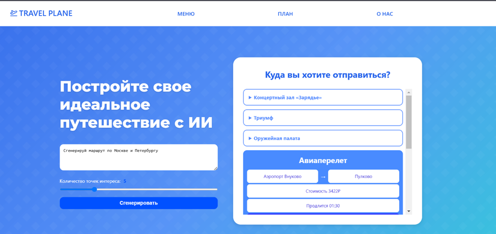
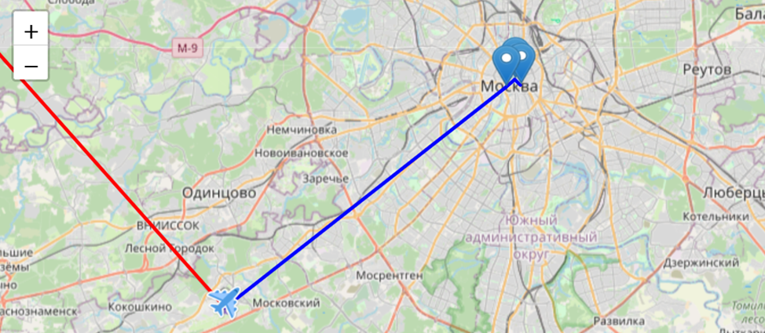
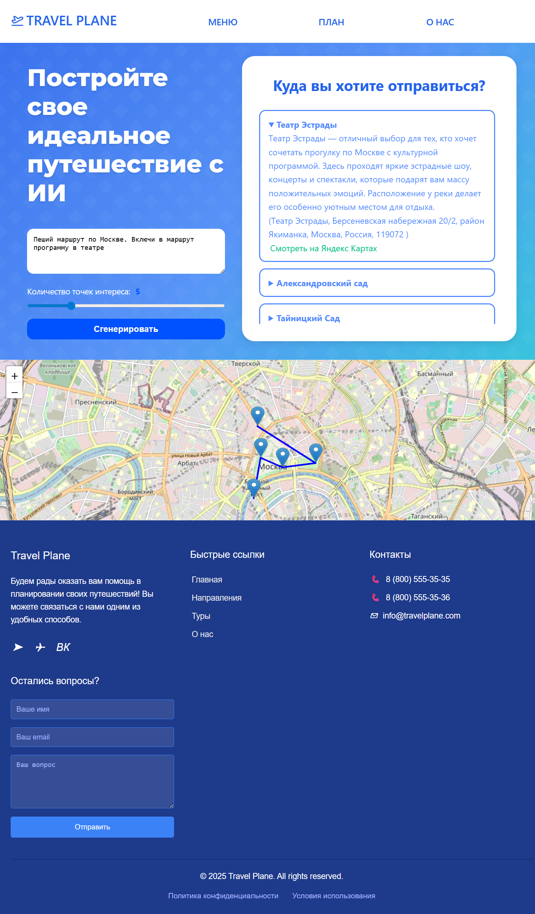

# ✈️ TravelPlane — AI Travel Planner


**TravelPlane** — это интеллектуальный веб-сервис для автоматического планирования путешествий. Приложение генерирует персонализированные маршруты на основе текстового запроса пользователя, используя возможности искусственного интеллекта и интеграцию с туристическими API. Данные маршрута отображаются на карте, а также в подробном листе маршрута с описаниями.

**📅 Работа над проектом**
* Май 2025: Проект разработан в качестве курсовой работы по специальности «Информационные системы и программирование».
* Март 2026: Проведена реорганизация репозитория. К опубликованному ранее фронтенду добавлен финальный бэкенд-код (образца 2025 года).

---

## ✨ Возможности

*   **🗺 Генерация маршрута по текстовому описанию:** Пользователь описывает желаемый отдых (например, *"Романтическая прогулка в Париже с рестораном"*), а система строит маршрут.
*   **🤖 Искусственный интеллект:** Использует LLM (Mistral AI) для подбора интересных локаций и создания логических цепочек путешествия.
*   **📍 Интерактивная карта:** Визуализация маршрута, маркеров и путей с помощью **Leaflet** и **OpenStreetMap**.
*   **🏨 Умный поиск отелей и авиабилетов:**
    *   Автоматический поиск авиабилетов (Aviasales), если расстояние между точками превышает 250 км.
    *   Подбор отелей (Amadeus/Hotellook) в местах остановок.
*   **⚡ Реактивный интерфейс:** UI на **Vue.js**.

---

## 🛠 Технологический стек

### Frontend
*   **Framework:** Vue.js 3
*   **Maps:** Leaflet.js (OpenStreetMap)
*   **HTTP Client:** Fetch API / Axios

### Backend
*   **Platform:** Node.js
*   **Server:** Express.js
*   **Language:** TypeScript / JavaScript

### External APIs
1.  **Mistral AI** — генерация логики маршрута и описания мест.
2.  **Geoapify** — геокодирование, поиск мест по категориям, координаты.
3.  **Travelpayouts (Aviasales)** — поиск авиабилетов.
4.  **Amadeus (Hotellook)** — поиск отелей.

---

## ⚙️ Как это работает (Алгоритм)

1.  **Запрос:** Пользователь вводит описание путешествия и желаемое количество точек.
2.  **Итеративная генерация:**
    *   ИИ анализирует контекст и предлагает следующий город/локацию.
    *   Backend запрашивает координаты и детали места через Geoapify.
    *   ИИ формирует описание для конкретной точки.
3.  **Логистика:**
    *   Система анализирует расстояние между точками.
    *   Если > 50 км — ищется отель.
    *   Если > 250 км — ищется ближайший аэропорт и авиабилеты.
4.  **Рендер:** Готовый JSON с маршрутом отправляется на фронтенд для отрисовки на карте.

---

**Примеры использования сервиса**


*Пример запроса и сгенерированного маршрута*


*Пример маршрута с перелетом на карте*


*Скриншот всего сайта*

---

## 🚀 Установка и запуск

Для запуска проекта вам понадобятся установленный **Node.js** и ключи API от используемых сервисов.

Для работы проекта требуется создать ключи на следующих сервисах:

* [Geoapify](https://geoapify.com/) — для поиска локаций и геокодинга.
* [TravelPayouts и Hotellook](https://www.travelpayouts.com/) — для поиска авиабилетов и данных Hotellook.
* [Amadeus for Developers](https://developers.amadeus.com/) — для получения `amadeusClientId` и `amadeusClientSecret`.
* [Mistral AI](https://mistral.ai/) — для работы искусственного интеллекта.


После необходимо создать .env файл в корне проекта и добавить ключи:


```Env
geoapifyApiKey=your_geoapifyApiKey
travelpayoutsApiKey=your_travelpayoutsApiKey
amadeusClientId=your_amadeusClientId
amadeusClientSecret=your_amadeusClientSecret
hotellookToken=your_hotelApiToken
mistralApiKey=your_mistralApiKey

server_port=3000
```

### Клонирование репозитория и запуск
```bash
git clone https://github.com/treketerer/TravelPlane.git
cd TravelPlane
npm install
node app.js
```

